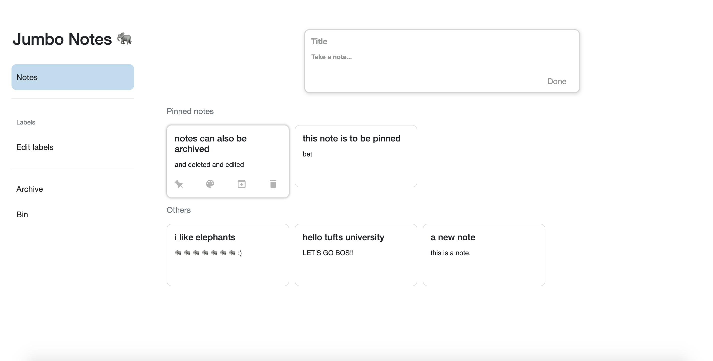

# notability - Jumbo Notes

Basically, a Google Keep clone made from scratch :-)
(using HTML, CSS, JS)

Working functionalities:
1. Edit notes (by clicking on the note)
2. Pin/Unpin notes
3. Archive/Unarchive notes
4. Delete notes 

Todo:
1. Changeable background color
2. Binned notes
3. Notes with Labels
4. Update UI using Material Design 

